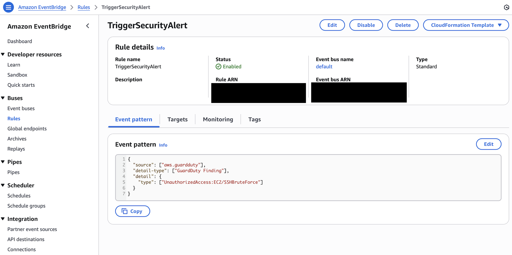
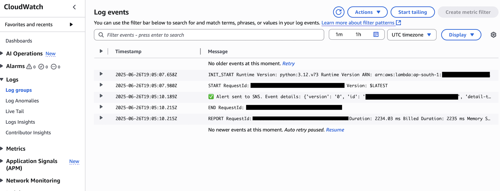
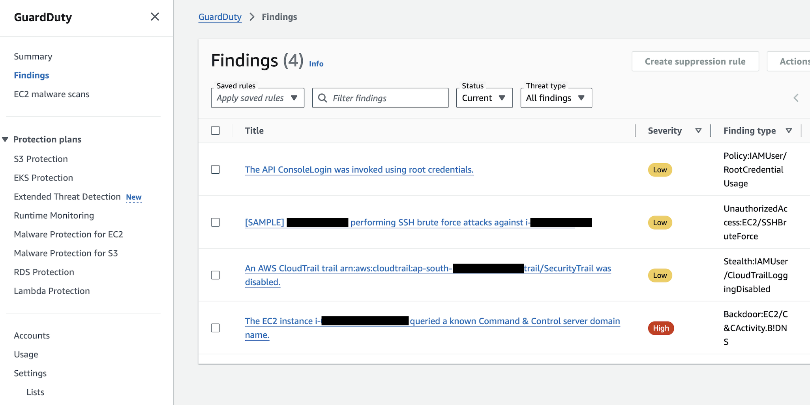
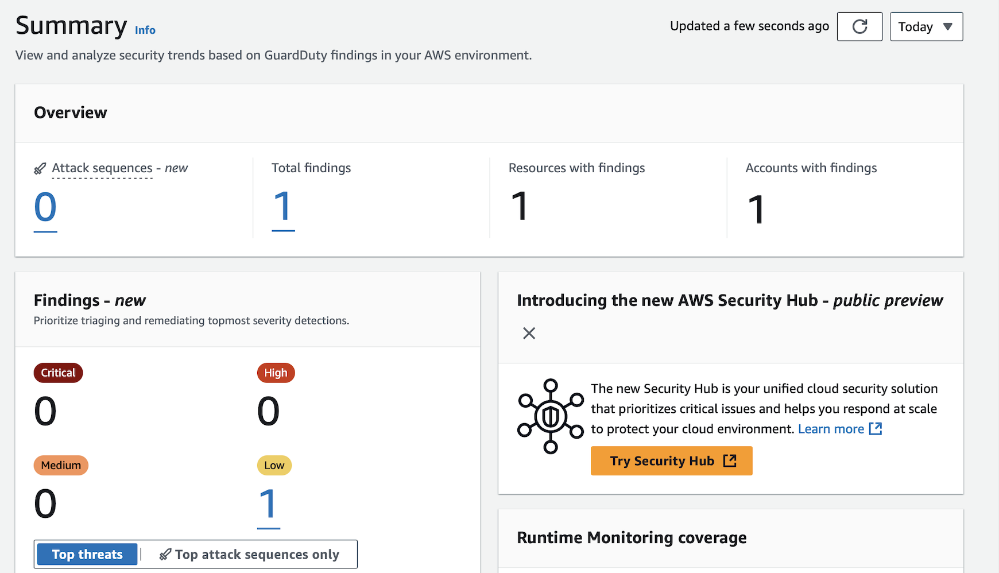
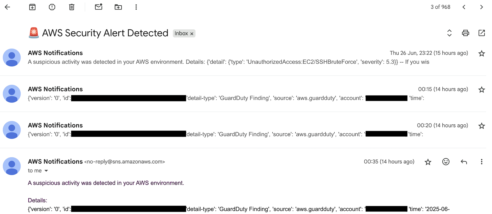

# 🛡️ AI-Powered Security Alert System on AWS

[](https://www.credly.com/badges/e8e56a26-b626-4c1c-b628-a09a277be295/public_url)
[](https://aws.amazon.com/)
[](#)
[](#)
[](#)
[](#)


A real-time security monitoring system for AWS — built using 100% native AWS services. No complex ML setup. Just smart architecture, clean automation, and a hunger to learn cloud security.

---

## 📌 Project at a Glance

| Category       | Details                                                  |
|----------------|-----------------------------------------------------------|
| 👨‍💻 What is it? | Cloud Security / DevSecOps Automation Project            |
| 🛠️ Built With   | GuardDuty, Lambda, EventBridge, SNS, CloudTrail, Athena |
| 📨 What it does | Sends real-time email alerts when AWS detects a threat   |
| 💼 Why it matters | Demonstrates hands-on cloud security experience         |

---

## 🚀 Why I Built This

As someone diving deep into cloud security, I wanted to build something practical — something a real company might use. This project helped me:

- Understand how real-time threat detection works
- Explore how AWS services talk to each other in a secure, scalable way
- Learn by building — not just reading docs

---

## 🧠 What It Actually Does

This system acts like a **24/7 cloud watchdog** 🐶 for your AWS account:

- **Tracks API activity** using CloudTrail  
- **Monitors traffic** using VPC Flow Logs  
- **Detects threats** using GuardDuty’s built-in AI (like brute-force or malware)  
- **Triggers alerts** when something suspicious happens  
- **Sends you an email instantly** with the alert details

And all of this happens **automatically** — no manual intervention, no ML model training.

---

## 🏗️ Architecture Overview

- **AWS CloudTrail** – Tracks API calls and user activity  
- **Amazon VPC Flow Logs** – Captures network traffic within VPCs  
- **Amazon GuardDuty** – Uses ML to detect threats (e.g., SSH brute force, malware)  
- **Amazon S3** – Stores all raw logs centrally  
- **Amazon Athena** – SQL-based querying of logs in S3  
- **Amazon EventBridge** – Watches for suspicious events (like unauthorized access)  
- **AWS Lambda** – Sends real-time alerts when EventBridge rules match  
- **Amazon SNS** – Delivers security alerts via email  

---

## 🧪 How I Tested It

- Launched a test EC2 instance  
- Simulated a brute-force SSH attack  
- GuardDuty detected the attack and generated a finding ✅  
- EventBridge picked it up and triggered a Lambda  
- Lambda formatted the alert and sent it to SNS  
- Got an alert email in real time — it worked just like planned  
- Cleaned up all resources to avoid any billing surprises


---

## 📸 Screenshots

### ⚙️ EventBridge Rule Configuration  
This rule watches for specific GuardDuty events and triggers Lambda:  




### 🔍 Lambda Execution Log  
The function runs on threat detection and pushes alerts via SNS:  




### 🛡️ GuardDuty Detection Log  
A real-time detection of a simulated brute-force attack:  




### 📊 GuardDuty Summary Dashboard  
See all active findings categorized by severity:  




### 📬 SNS Email Alert  
Sample email received from SNS upon threat detection: 




## 🗂️ Project Structure

```bash
/aws-security-alert-system
├── README.md                         # Full project walkthrough
├── lambda/
│   └── alert_handler.py              # SNS email logic on threat detection
├── eventbridge/
│   └── guardduty-event-pattern.json  # EventBridge rule for triggering Lambda
└── screenshots/
    ├── eventbridge-rule.png
    ├── guardduty-findings.png
    ├── guardduty-summary.png
    ├── lambda-log.png
    └── sns-email-alert.png
```


---

## 💡 What I Learned

This project taught me way more than just connecting AWS services:

- The **difference between API logging and network logging**
- How **event-driven architecture** works in security automation
- That **you don’t need to be a machine learning expert** to use ML-powered tools
- The **importance of IAM roles and least privilege**
- Why **cleaning up unused resources** is as important as setting them up

---

## 📚 Tools & Services Used

| AWS Service         | Why I Used It                              |
|---------------------|--------------------------------------------|
| GuardDuty           | AI-based threat detection                  |
| Lambda              | Real-time alert handler                    |
| SNS                 | Instantly sends email notifications        |
| CloudTrail          | Tracks user/API activity                   |
| VPC Flow Logs       | Captures network-level behavior            |
| S3                  | Stores all logs securely                   |
| Athena              | Run SQL queries on logs (future use)       |
| EventBridge         | Connects threat detection to action        |

---


## 📬 Sample Security Alert (Email Format)

```
🚨 AWS Security Alert Detected

A suspicious activity was detected in your AWS environment.

Details:
UnauthorizedAccess:EC2/SSHBruteForce
Severity: 5.3 (Medium)
Region: ap-south-1
```


---

## 🧼 Clean-Up Checklist

> One thing I’ve learned — never leave cloud resources running.

✅ Terminated test EC2 instance  
✅ Deleted CloudTrail trails (after testing)  
✅ Removed VPC Flow Logs  
✅ Disabled GuardDuty (after verification)  
✅ Deleted EventBridge rule and Lambda  
✅ Unsubscribed from SNS  
✅ Emptied & removed S3 buckets  
✅ Reviewed billing dashboard to confirm $0 usage  

---

## 🌱 What’s Next

- 🔍 Use **Athena** to analyze logs in S3  
- 📊 Add **QuickSight** or **OpenSearch** dashboards  
- 🔒 Enable **Auto-Remediation** (e.g., block malicious IPs automatically)  
- 🧠 Experiment with **Amazon Lookout for Metrics** (optional)

---


## 💰 Cost Breakdown

One of my goals was to keep this project **fully within the AWS Free Tier**. Here’s how I achieved that:

| Service         | Usage Type               | Cost       | Notes |
|----------------|---------------------------|------------|-------|
| CloudTrail      | Management events         | $0         | Free for 90 days |
| VPC Flow Logs   | Limited duration + filter | $0         | Cost-optimized by limiting scope |
| GuardDuty       | Free trial (30 days)      | $0         | Disabled after test to avoid charges |
| S3              | Minimal log storage       | ~$0.01     | Used infrequent access class |
| Athena          | No queries run (yet)      | $0         | Planned for later |
| EventBridge     | Small volume of rules     | $0         | Fits in free tier |
| Lambda          | Low invocations           | $0         | Free tier covers 1M invocations/month |
| SNS             | Email alerts only         | $0         | First 1,000 emails are free |

> ✅ Total Cost: **$0.01 or less** (Covered by AWS Free Tier)

⚠️ **Note:** I manually disabled/deleted all services after testing to prevent unexpected billing.

---

## 🙋‍♂️ About Me

**Deepbendu Debnath**  
AWS Certified Solutions Architect – Associate | Cloud Security Explorer | Full Stack Developer | C++ Problem Solver  
Made with ❤️ in India 🇮🇳

I’m a hands-on builder passionate about cloud security, automation, and meaningful tech. This project reflects my journey into **DevSecOps using AWS-native services** — combining **real-time monitoring**, **event-driven automation**, and **security-first thinking**.

🛡️ I also hold the **[AWS Certified Solutions Architect – Associate](https://cp.certmetrics.com/amazon/en/public/verify/credential/40d503c796ac43eb9f5d3912b5adad30)** credential, which deepened my understanding of building secure, scalable, and cost-optimized cloud solutions.

> I didn’t just build this project — I built real-world cloud confidence.

---

## 📬 Let’s Connect

I’m open to:

- 🚀 Entry-level full-time roles
- 🛠️ Internships, collaborative builds, or open-source work  
- 🤝 Cloud security conversations, mentorship, or guidance

> 📧 debnathdeepbendu@gmail.com  
💼 [LinkedIn](https://linkedin.com/in/deepbendu-debnath) &nbsp;&nbsp;|&nbsp;&nbsp; 📁 [GitHub](https://github.com/Deepbendu) &nbsp;&nbsp;|&nbsp;&nbsp; 🧩 [LeetCode](https://leetcode.com/deepbendu)

---

## 📜 AWS Certification Verification

You can verify my AWS Certified Solutions Architect – Associate credential here:  
🔗 [Verify my AWS Certification](https://cp.certmetrics.com/amazon/en/public/verify/credential/40d503c796ac43eb9f5d3912b5adad30) &nbsp;&nbsp;|&nbsp;&nbsp;
🔗 [Verify my Credly Badge](https://www.credly.com/badges/e8e56a26-b626-4c1c-b628-a09a277be295/public_url)
